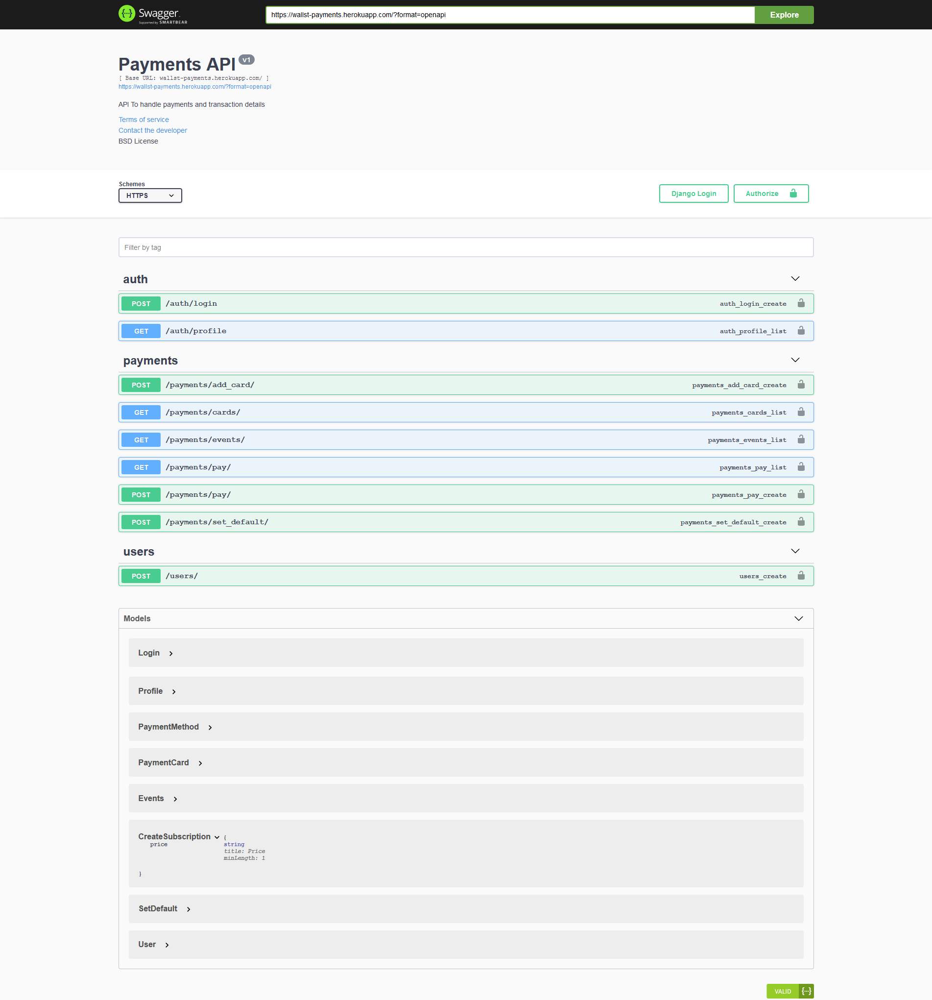
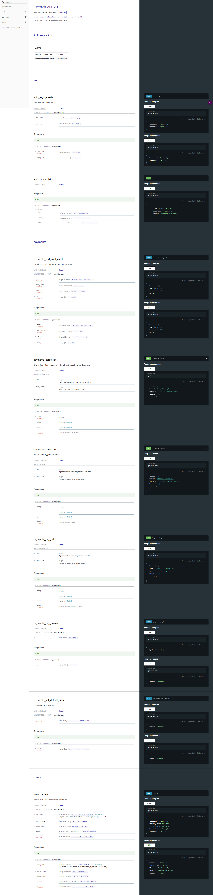

# sports_events
Provides API for list, get match for betting

Built as Rest API, this uses `django-rest-framework` and `django`. Database used is `MySQL`. The app is documented with Swagger and redoc.

# Demo URL

Heroku App[url](https://wallst-payments.herokuapp.com/)

# Setup

 All requirements needed are listed under `requirements.txt`. To install

    pip install -r requirements.txt
    
# Starting the server
To start the Django WSGI engine,
    
    python manage.py runserver

# Testing 
To test the app,

    python manage.py test
    
This runs all the testcases defined in all the apps, defined in `tests.py` in each app.

# Sample Images

## Swagger Documentation

## ReDoc Documentation

